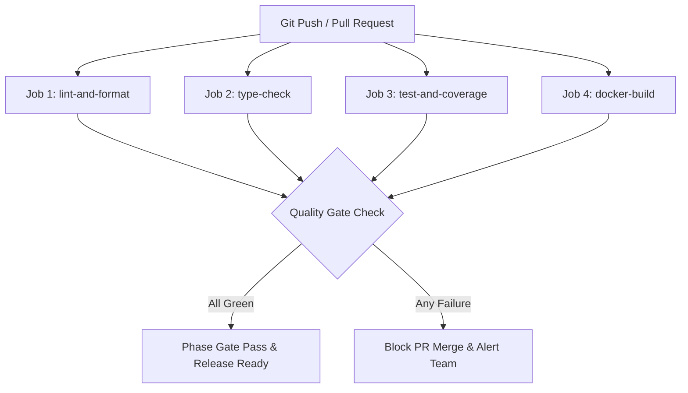

# FLAWNETIC ENGINEERING PLAYBOOK
**Document ID:** `PLAYBOOK-FLAWNETIC-2026-001`  
**Version:** 1.0  
**Status:** LEVEL 2 GOVERNANCE DOCUMENT  
**Classification:** OPERATIONAL PLAYBOOK  
**Precedence Level:** Level 2 (Overrides Level 3–6 Documents; Aligns with `MANIFESTO.md` & `GOVERNANCE_INDEX.md`)  
**Approval Authority:** Engineering Manager & DevSecOps Lead

---

## 1. PURPOSE & APPLICABILITY

The **Flawnetic Engineering Playbook** is the official operational handbook governing how software is researched, designed, implemented, tested, reviewed, secured, released, and maintained across the codebase.

It translates the core values of [`MANIFESTO.md`](file:///d:/Desktop/Flawnetic/MANIFESTO.md) and the structural hierarchy of [`GOVERNANCE_INDEX.md`](file:///d:/Desktop/Flawnetic/GOVERNANCE_INDEX.md) into explicit, reproducible engineering workflows.

> **Applicability**: This playbook applies to **every software engineer**, **AI coding agent**, **open-source contributor**, and **automated pipeline** interacting with the Flawnetic repository.

---

## 2. THE 16-STAGE ENGINEERING LIFECYCLE

```text
 1. Research & Discovery
       │
       ▼
 2. Product Requirement Document (PRD)
       │
       ▼
 3. Technical Design Document (TDD)
       │
       ▼
 4. Architecture Challenge Board (ACB)
       │
       ▼
 5. Architecture Approval
       │
       ▼
 6. Sprint & Task Planning
       │
       ▼
 7. Development & Implementation
       │
       ▼
 8. Developer Self-Review
       │
       ▼
 9. AI Agent Quality Review
       │
       ▼
10. DevSecOps & Security Audit
       │
       ▼
11. QA & Test Suite Validation
       │
       ▼
12. CI/CD Pipeline Execution
       │
       ▼
13. Enterprise Phase Gate Review
       │
       ▼
14. Production Release & Deployment
       │
       ▼
15. Observability & Monitoring
       │
       ▼
16. Lessons Learned & AI Memory Sync
```

---

## 3. GIT WORKFLOW & BRANCHING STRATEGY

### 3.1 Branching Model
- **`main`**: Production-ready branch. Protected. Direct commits prohibited.
- **`feature/<short-name>`**: New feature development (e.g. `feature/zap-dast-engine`).
- **`fix/<issue-id>`**: Bug fixes (e.g. `fix/cors-wildcard-hardening`).
- **`release/v<X.Y.Z>`**: Release preparation and staging validation branches.
- **`hotfix/<issue-id>`**: Urgent production security patches.

### 3.2 Commit Conventions (Conventional Commits)
All commit messages MUST follow the structure: `<type>(<scope>): <short description>`
- `feat(security)`: Add OWASP ZAP active scan rate throttling
- `fix(report)`: Resolve text truncation in FPDF2 multi-cell generator
- `test(api)`: Add pytest router coverage for /scans endpoints
- `docs(ai)`: Update .ai/CONTEXT.md for Sprint 2.5 Recovery
- `chore(deps)`: Clean up deprecated weasyprint dependency

### 3.3 Pull Request & Merge Policy
- **PR Requirements**: Minimum 1 human Staff Engineer approval, passing GitHub Actions CI pipeline, zero unresolved review comments.
- **Merge Strategy**: **Squash and Merge** to maintain a linear commit history on `main`.

---

## 4. SPRINT & FEATURE DEVELOPMENT WORKFLOW

### 4.1 Feature Prerequisites
No engineer or AI agent may begin writing implementation code until the following Level 4/5 documents are complete and approved:
1. Approved PRD or Feature User Story.
2. Approved Technical Design Document (TDD) with Threat Model.
3. Architecture Challenge Board (ACB) sign-off.
4. Recovery Sprint Task entry with defined Definition of Done.

---

## 5. CODE REVIEW & QUALITY WORKFLOW

### 5.1 Code Review Responsibilities
Reviewers must verify:
- **Architecture**: Adherence to SOLID, modularity, explicit naming, and zero single-letter variables.
- **Security**: No secrets in code, input sanitization, PII redaction, strict CORS, rate-limiting.
- **Testing**: Pytest unit/integration tests added; test coverage target met ($\ge 90\%$).
- **Performance**: No unindexed queries, blocking main thread loops, or memory leak risks.

---

## 6. TESTING WORKFLOW & QUALITY GATES

### 6.1 Required Testing Pyramid
Every feature must supply evidence across 5 testing dimensions:
1. **Unit Tests**: Test utility functions (`report/utils.py`, `sanitize_text`, `compute_risk_score`).
2. **Integration Tests**: Test API router endpoints using FastAPI `TestClient` and PostgreSQL/Redis service containers.
3. **Engine Tests**: Test `FunctionalEngine`, `SecurityEngine`, `AccessibilityEngine`, and `AITriageEngine` modules.
4. **Security Tests**: Test authentication expiry, rate-limiting triggers, and CORS origin blocking.
5. **Accessibility Tests**: Test WCAG 2.1 AA violation detection via `axe-playwright-python`.

### 6.2 Test Coverage Gate
- **Line Coverage Target**: **$\ge 90.0\%$** across `backend/` codebase.
- **CI Failure Threshold**: `pytest --cov=backend --cov-fail-under=90` fails the build if coverage falls below 90%.

---

## 7. CI/CD WORKFLOW & AUTOMATED PIPELINE

### 7.1 GitHub Actions Job Hierarchy (`.github/workflows/ci.yml`)



---

## 8. DOCUMENTATION & AI WORKSPACE WORKFLOW

### 8.1 Documentation Principles
- **Documentation is Code**: Whenever behavior or architecture changes, documentation MUST change in the same PR.
- **ADR Mandatory**: Any architectural trade-off or structural change requires adding an entry to `.ai/DECISIONS.md`.
- **AI Workspace Sync**: At the end of every engineering session, update `.ai/CONTEXT.md`, `.ai/MEMORY.md`, and `.ai/CHANGELOG.md`.

---

## 9. RELEASE & INCIDENT RESPONSE WORKFLOW

### 9.1 Release Lifecycle
1. Cut `release/vX.Y.Z` branch from `main`.
2. Execute automated smoke tests and production build check (`docker compose build`).
3. Tag git commit (`vX.Y.Z`) and publish release notes generated from `.ai/CHANGELOG.md`.

### 9.2 Incident Severity & Response Protocols
- **SEV-1 (Critical Outage / Remote Exploit)**: Immediate hotfix deployment, rollback to previous release tag within 15 minutes, post-mortem ADR within 24 hours.
- **SEV-2 (Feature Degradation)**: Patch fix within 24 hours, update test suite to prevent regression.

---

## 10. AI AGENT OPERATING WORKFLOW

When an AI agent (Claude Code, Gemini CLI, Cursor) interacts with this codebase:

```text
 1. Read GOVERNANCE_INDEX.md & MANIFESTO.md
       │
       ▼
 2. Read devcore-standards.html & .ai/INDEX.md
       │
       ▼
 3. Inspect .ai/CONTEXT.md for Active Sprint Goal
       │
       ▼
 4. Search & Read Authoritative Source Files (Never Guess)
       │
       ▼
 5. Create / Update Implementation Plan Artifact
       │
       ▼
 6. Implement Minimal, High-Quality Code Edits
       │
       ▼
 7. Run Pytest Suite & Linters locally
       │
       ▼
 8. Synchronize .ai/ Memory Files (MEMORY.md, CONTEXT.md, CHANGELOG.md)
```

---

## 11. DEFINITION OF DONE (DoD)

A task or pull request is **DONE** only when:
- [ ] **Code Implementation Complete**: Clean code written adhering to SOLID and explicit naming rules.
- [ ] **Tests Passing**: All unit and integration tests pass cleanly with zero skips.
- [ ] **Coverage Gate Met**: Line coverage verified $\ge 90.0\%$ via `pytest-cov`.
- [ ] **Linters & Typers Green**: `ruff check`, `black --check`, and `mypy` pass with 0 errors.
- [ ] **CI/CD Pipeline Green**: All jobs in `.github/workflows/ci.yml` succeed.
- [ ] **Security Review Approved**: CORS restricted, inputs sanitized, no hardcoded secrets.
- [ ] **Documentation & AI Workspace Synchronized**: Updated `CHANGELOG.md`, `CONTEXT.md`, and `MEMORY.md`.
- [ ] **PR Merged**: Approved and merged to `main` branch.

---

## 12. GOVERNANCE COMPLIANCE MATRIX

| Document Level | Document Name | Override Precedence | Owner |
| :--- | :--- | :--- | :--- |
| **Level 0** | Product Vision | Overrides All | Founder / ARB |
| **Level 1** | [`MANIFESTO.md`](file:///d:/Desktop/Flawnetic/MANIFESTO.md) | Overrides Level 2–6 | Architecture Review Board |
| **Level 2** | [`ENGINEERING_PLAYBOOK.md`](file:///d:/Desktop/Flawnetic/ENGINEERING_PLAYBOOK.md) | Overrides Level 3–6 | Engineering Manager (THIS FILE) |
| **Level 3** | DevCore Standards | Overrides Level 4–6 | Principal Engineers |
| **Level 4** | [`DECISIONS.md`](file:///d:/Desktop/Flawnetic/.ai/DECISIONS.md) (ADR) | Overrides Level 5–6 | Staff Architect |
| **Level 5** | Technical Design / Sprint Plan | Overrides Level 6 | Feature Lead |
| **Level 6** | Implementation Code & Tests | Base Layer | Assigned Engineer |
