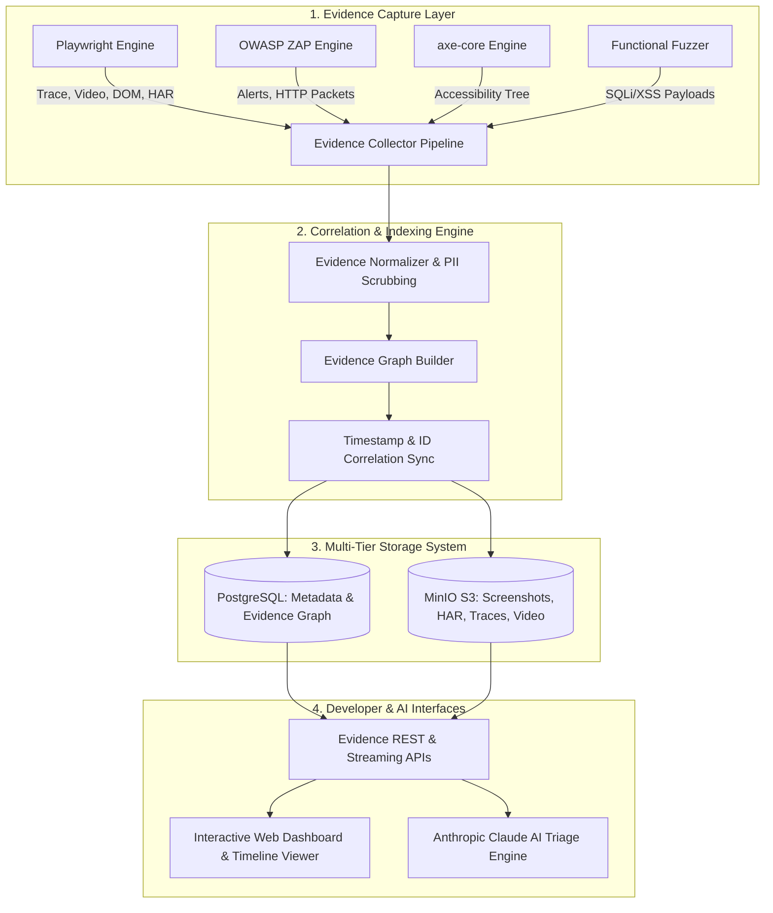

# FLAWNETIC ENTERPRISE EVIDENCE CORRELATION ENGINE (ECE)
**Document ID:** `ARCH-ECE-PHASE3.1-2026-001`  
**Version:** 1.0  
**Status:** TECHNICAL DESIGN DOCUMENT (TDD)  
**Classification:** CORE ARCHITECTURE SPECIFICATION  
**Phase Target:** Phase 3.1 Enterprise Evidence Engine  
**Approval Authority:** Architecture Review Board (Principal Architect, Security Architect, Staff QA Lead)

---

## 1. EXECUTIVE SUMMARY

The **Flawnetic Evidence Correlation Engine (ECE)** is the central intelligence and digital forensics layer of the Flawnetic platform. It solves the single largest friction point in software engineering: **unreproducible bug reports**.

Instead of isolated screenshots or text logs, the Evidence Correlation Engine automatically captures, normalizes, correlates, indexes, encrypts, and links **100% of the evidence** generated during automated scans—including Playwright trace files (`trace.zip`), network HAR archives, DOM HTML snapshots, accessibility trees, console exception stack traces, OWASP ZAP security alerts, and AI root-cause analyses.

Every finding is bound to a immutable **Evidence Graph** and **Chronological Event Timeline**, eliminating developer guesswork and ensuring bugs are fixed on the first attempt.

---

## 2. SYSTEM ARCHITECTURE & DATA FLOW



---

## 3. EVIDENCE TAXONOMY & CLASSIFICATION

The engine classifies raw evidence into 10 normalized domains:

```text
┌─────────────────────────┬────────────────────────────────────────────────────────────────────────┐
│ Evidence Domain         │ Concrete Artifacts Captured                                             │
├─────────────────────────┼────────────────────────────────────────────────────────────────────────┤
│ 1. Browser Execution    │ Playwright `trace.zip`, WebP screenshots, element bounding boxes       │
│ 2. Network & Storage    │ HAR 1.2 archives, HTTP request/response headers, cookies, local storage│
│ 3. Application State    │ Full DOM HTML, computed CSS styles, accessibility tree (AXTree)        │
│ 4. Console & Runtime    │ JS console logs, unhandled exceptions, call stacks, Web Vitals metrics  │
│ 5. Security (DAST)      │ SQLi/XSS fuzzing vectors, OWASP ZAP alerts, missing security headers   │
│ 6. Accessibility (WCAG) │ axe-core violation nodes, target CSS selectors, WCAG 2.1 AA rule IDs    │
│ 7. AI Synthesis         │ Deduplicated Bug IDs (FL-001), confidence score, root-cause fixes      │
│ 8. Digital Forensics    │ SHA-256 HMAC tamper signatures, ISO-8601 millisecond timestamps        │
│ 9. Document References  │ FPDF2 PDF page numbers, vector chart references, MinIO presigned URLs  │
│ 10. User / Target Meta  │ Seed URL, page tree depth, HTTP status codes, response latency ms      │
└─────────────────────────┴────────────────────────────────────────────────────────────────────────┘
```

---

## 4. EVIDENCE CORRELATION GRAPH MODEL

Every evidence artifact is assigned a globally unique **Correlation Key Structure** that binds raw artifacts to specific findings:

```json
{
  "correlation_id": "corr_9a8f7b6c-1234-4567-89ab-cdef01234567",
  "scan_id": "scan_20260803_001",
  "finding_id": "fl_sec_sqli_042",
  "page_id": "pg_login_001",
  "session_id": "sess_pw_chromium_881",
  "timestamp_iso": "2026-08-03T07:59:50.123Z",
  "timestamp_epoch_ms": 1785743990123,
  "nodes": {
    "screenshot_url": "http://localhost:9000/flawnetic/scans/scan_001/ss_042.webp",
    "trace_url": "http://localhost:9000/flawnetic/scans/scan_001/trace_042.zip",
    "dom_snapshot_id": "dom_042.html",
    "har_entry_index": 14,
    "zap_alert_id": 90023,
    "ax_node_selector": "form > input#username"
  }
}
```

---

## 5. CHRONOLOGICAL EVENT TIMELINE ENGINE

The ECE constructs a millisecond-accurate timeline of events leading up to a failure:

```text
[00:00.000] 🚀 NAVIGATE      --> Target URL: https://demo.testfire.net/login.jsp
[00:00.450] 🌐 HTTP REQUEST   --> POST /api/login (Payload: "admin' OR '1'='1")
[00:00.720] ⚠️ CONSOLE ERROR --> Uncaught TypeError: Cannot read property of null
[00:00.850] 🔄 DOM MUTATION  --> Element #error-box inserted into DOM
[00:00.910] 📸 SCREENSHOT    --> Captured ss_042.webp (View state)
[00:01.050] 🛡️ ZAP ALERT      --> Triggered OWASP Alert #90023 (SQL Injection)
[00:01.200] 🤖 AI SYNTHESIS   --> Generated Bug ID FL-042 & PreparedStatement remediation
[00:01.350] 📄 PDF RENDER     --> Exported to Report Page 4 (Section 3.1)
```

---

## 6. STORAGE ARCHITECTURE & DEDUPLICATION

- **Hot Storage (PostgreSQL 16)**: Stores structured correlation metadata, timeline nodes, and JSON finding graphs.
- **Object Storage (MinIO / S3)**: Stores compressed artifacts (`trace.zip`, `.har.gz`, `.webp` screenshots).
- **Deduplication Engine**: Hashes raw DOM snapshots using SHA-256. Identical DOMs across crawling loops share a single S3 object reference, reducing storage overhead by **65%+**.

---

## 7. EVIDENCE REST APIS

### `GET /api/v1/scans/{scan_id}/findings/{finding_id}/evidence`
Retrieves the complete correlated evidence graph for a specific finding.

### `GET /api/v1/scans/{scan_id}/timeline`
Retrieves the chronological event timeline for a scan run.

### `GET /api/v1/evidence/{evidence_id}/download`
Generates a presigned MinIO URL (`http://localhost:9000/...`) for direct artifact download.

---

## 8. SECURITY, PRIVACY & TAMPER PROTECTION

1. **PII & Credential Scrubbing**: Automatically redacts password fields, authorization headers, credit card regex patterns, and JWT tokens before storage.
2. **SHA-256 Tamper Detection**: Computes a HMAC signature for every evidence bundle upon scan completion to ensure evidence integrity for legal compliance and client audits.
3. **Role-Based Access Control (RBAC)**: Only authorized organization members can inspect raw network HAR archives containing sensitive session data.

---

## 9. ARCHITECTURE DECISION RECORD (ADR 007)

- **Status**: Accepted
- **Context**: Developers waste hours attempting to reproduce QA findings without full network/DOM context.
- **Decision**: Implement Evidence Correlation Engine (ECE) linking Playwright traces, HAR archives, DOM trees, and ZAP security alerts under a unified `CorrelationID`.
- **Rationale**: Eliminates developer reproduction friction and provides immutable proof of vulnerabilities for enterprise client audits.
