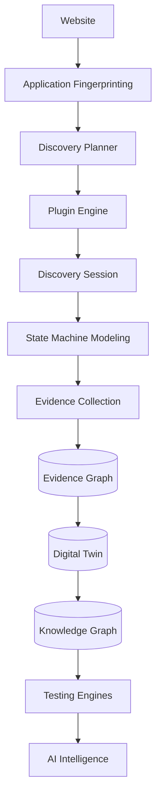

# FLAWNETIC PHASE 2: EPIC 1 - ENTERPRISE DISCOVERY & DIGITAL TWIN PLATFORM
**Status:** 🟢 APPROVED FOR IMPLEMENTATION
**Review ID:** EPIC1-ARB-FINAL

---

## 1. PLATFORM VISION & PIPELINE ARCHITECTURE

Epic 1 delivers the absolute foundational layer of the Flawnetic ecosystem: The Enterprise Discovery Platform. This platform does not "crawl" URLs; it builds an immutable **Evidence Graph**, which resolves into a versioned **Digital Twin**, which in turn feeds the **Knowledge Graph** and all downstream AI and Testing engines.

### 1.1 The Ultimate Discovery Pipeline


### 1.2 Pipeline Stages & Contracts
Every stage of discovery is an explicit, observable pipeline step featuring specific inputs, outputs, failure policies, and telemetry.
1. **Preflight Analysis & Fingerprint:** Analyzes technology stack to load correct plugins.
2. **Discovery Planning:** Policy Engine applies rules (e.g., "Skip Logout", "Read-Only Mode") based on the selected Discovery Profile (e.g., Quick Scan vs. Certification Scan).
3. **Navigation & Interaction:** Executes state transitions using behavioral plugins (Click, Drag, Swipe).
4. **Behavior & Evidence Capture:** Captures DOM snapshots, network HARs, and screenshots (Immutable Evidence).
5. **State Analysis & Graph Construction:** Generates structurally hashed Component IDs.
6. **Digital Twin Update & Event Publishing:** Publishes standardized events to the Event Bus.

---

## 2. CORE ARCHITECTURAL CONCEPTS

### 2.1 The Evidence Graph vs. Digital Twin
*   **The Evidence Graph:** Immutable. It stores raw observations from a specific `DiscoverySession` (Screenshots, DOM dumps, network logs). Evidence never disappears.
*   **The Digital Twin:** The current, reasoned state of the application. It is constructed and updated by interpreting the Evidence Graph.
*   **The Knowledge Graph:** The semantic, inferred reasoning layer built on top of the Digital Twin for AI consumption.

### 2.2 Discovery Sessions & Incremental Discovery
*   **Discovery Session:** Every crawl is encapsulated in a Session ID. This guarantees reproducibility and tracks metrics, logs, and evidence isolated to that specific run.
*   **Incremental Discovery (Difference Engine):** Flawnetic does not re-discover the entire app daily. It compares today's `DiscoverySession` against the baseline `DigitalTwin vCurrent`. Only modified components and new states are updated (Twin v1 -> Twin v2), drastically reducing CI/CD execution time.

### 2.3 Component Identity & Knowledge Contracts
*   **Stable Component Identity:** Components are identified not by fragile CSS selectors, but by a derived `Component ID` -> `Semantic ID` -> `Structural Hash` -> `Version`.
*   **Knowledge Contracts:** Every Discovery Plugin must yield data conforming to a strict JSON schema contract:
    ```json
    {
      "entity_type": "Component|State|Transition",
      "entity_id": "hash-1234",
      "confidence": 0.99,
      "relationships": ["parent_id", "child_id"],
      "evidence": ["s3://evidence-graph/snap1.png"],
      "metadata": {"semantic_label": "Primary CTA"}
    }
    ```

### 2.4 Discovery Quality Metrics (KPIs)
To guarantee discovery success, the platform calculates:
*   **Coverage %** (Estimated state space vs. discovered states)
*   **Behavior Coverage** (Forms tested, Transitions executed)
*   **Duplicate Rate** (Identifies failure in Structural Hashing)
*   **Digital Twin Completeness** (Overall confidence score of the generated Twin)

---

## 3. IMPLEMENTATION ROADMAP (4 Milestones)

To ensure independent testability and maintain engineering discipline, Epic 1 is decomposed into four strict milestones:

### Milestone 1: Discovery Foundation
*   Implement Application Fingerprinting.
*   Build the `DiscoverySession` orchestrator.
*   Establish the Event Bus and standardized Knowledge Contracts.
*   Implement the core Plugin Framework.

### Milestone 2: Application Modeling
*   Develop the Application State Machine.
*   Construct the Application Graph data models.
*   Implement the immutable **Evidence Graph**.
*   Generate the baseline **Digital Twin**.

### Milestone 3: Intelligent Discovery
*   Build the Crawl Intelligence Engine (Adaptive Scheduling).
*   Implement Semantic Discovery capabilities.
*   Develop the Discovery Policy Engine (Rulesets & Profiles).
*   Implement the Difference Engine for Incremental Discovery.

### Milestone 4: Enterprise Scale & Certification
*   Distributed node architecture (Celery/K8s scaling).
*   Performance optimization and memory leak mitigation (BCM TTLs).
*   Resilience and Failure/Retry policies.
*   Final Certification test suite.

---

## 4. ARCHITECTURE DECISION RECORDS (ADRs)

*   **ADR-001 to ADR-004:** (Graph Modeling, Event-Driven, Plugins - Approved)
*   **ADR-005: Discovery Session Architecture.** Mandates that all discovery operations are bound to reproducible session entities.
*   **ADR-006: Evidence Graph Isolation.** Separates immutable raw evidence collection from the mutable Digital Twin state.
*   **ADR-007: Digital Twin Versioning.** Mandates structural versioning (Twin v1 -> v2) to allow historical diffing and rollback.
*   **ADR-008: Plugin Output Contract.** Enforces a strict schema for all plugin outputs to guarantee clean data ingestion by AI engines.
*   **ADR-009: Discovery Policy Engine.** Abstracts crawling rules (e.g., "Skip Logout") into configurable profiles rather than hardcoded logic.
*   **ADR-010: Incremental Discovery.** Mandates the use of a Difference Engine to only process structural DOM changes between sessions, enabling ultra-fast CI/CD integration.
