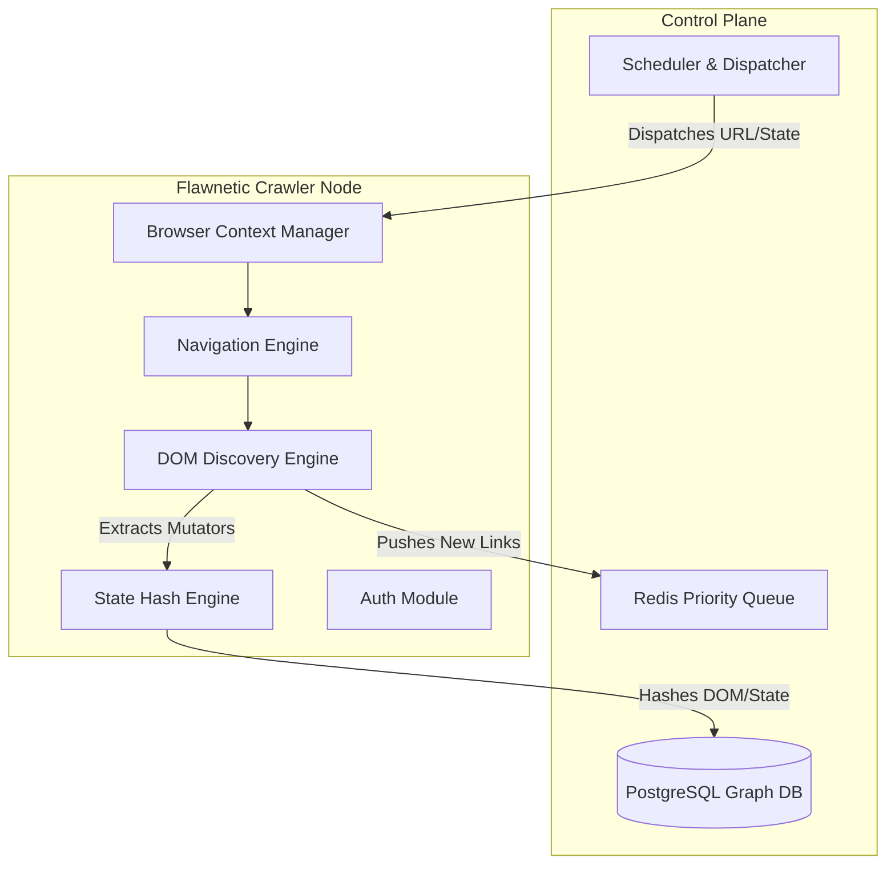

# FLAWNETIC PHASE 2: EPIC 1 - ADVANCED CRAWLING ENGINE
**Status:** Product Research, PRD, and Technical Architecture Proposed for Review.

---

## 1. PRODUCT RESEARCH & COMPETITIVE ANALYSIS

To build the world's most capable Quality Engineering (QE) crawler, we must synthesize the best parts of existing technologies and discard their weaknesses.

### Comparison Matrix

| Technology | Best Ideas / Strengths | Weaknesses / Missing Capabilities |
| :--- | :--- | :--- |
| **Playwright/Puppeteer** | Native CDP integration, exceptional SPA support, auto-waiting, network interception. | No built-in crawling logic, no state persistence out-of-the-box, no duplicate detection. |
| **Selenium/Cypress** | Massive ecosystem (Selenium), developer-friendly (Cypress). | Selenium is slow/flaky. Cypress is limited to a single tab/origin, terrible for cross-domain crawling. |
| **QA Wolf/Jam.dev** | High-fidelity DOM capture, state-machine generation, zero-setup environments. | Closed ecosystem, proprietary state engines, heavily reliant on manual recording phases. |
| **Apify/Crawlee** | Distributed queues, proxy management, robust retry/recovery, RequestQueue scale. | Primarily designed for scraping/SEO, lacks deep understanding of forms, shadow DOM, or QA states. |
| **OWASP ZAP / Burp** | Deep protocol-level spidering, risk-aware traversal, fuzzing integration. | Notorious for failing on modern SPAs (React/Vue). Blind to client-side routing and Shadow DOM. |
| **Googlebot/Screaming Frog** | Exceptional at parsing static graphs, canonicals, robots.txt, and scale. | Does not authenticate, does not submit forms, does not understand user journeys or application state. |

### Flawnetic's Strategy
*   **Adopt:** Playwright's execution environment (CDP speed) + Crawlee's distributed `RequestQueue` architecture + ZAP's security awareness.
*   **Improve:** Implement a **State-Aware Engine** that hashes the DOM structure to detect if two different URLs render the same visual state, avoiding infinite loops in dynamic apps.
*   **Avoid:** Pure HTTP spidering (too brittle for SPAs). Do not copy Selenium's WebDriver protocol (too slow).

---

## 2. PRODUCT REQUIREMENTS DOCUMENT (PRD)

### 2.1 Goals & Non-Goals
*   **Goals:** Discover 100% of the application surface area (Pages, SPAs, APIs, Forms, Shadow DOM, Iframes, Authentication flows). Generate a unified, queryable Functional Map.
*   **Non-Goals:** SEO analysis, general web scraping (extracting prices/articles for data mining), DDOS-level load testing.

### 2.2 Functional Requirements
*   **Stateful Crawling:** Must understand client-side routing (e.g., `#` or History API) and track state changes without full page reloads.
*   **Deep DOM Exploration:** Must recursively pierce `ShadowRoot` boundaries and cross-origin `iframe` boundaries (where permissions allow).
*   **Interaction Engine:** Must programmatically click non-link elements (`
`) that mutate state or open dialogs.
*   **Auth Continuity:** Must maintain session tokens (Cookies, LocalStorage, IndexedDB, SessionStorage) across distributed worker nodes.

### 2.3 Non-Functional Requirements
*   **Scalability:** Must support single-tenant crawls of 10 pages, up to enterprise distributed crawls of 100,000+ pages.
*   **Performance:** Worker memory must not exceed 2GB per browser context. Must aggressively clean up page objects to prevent memory leaks.
*   **Maintainability:** Pluggable architecture allowing new "Discovery Strategies" to be added without modifying the core navigation loop.

---

## 3. TECHNICAL DESIGN & ARCHITECTURE

The Flawnetic Crawling Engine operates as a distributed system, breaking away from the monolithic crawler approach.

### 3.1 Core Architecture Components

### 3.2 Sub-System Specifications

*   **Browser Context Manager (BCM):** Pools Playwright `BrowserContext` instances. Reuses contexts to share cache and auth state, but cycles them every 500 navigations to prevent Chromium memory leaks.
*   **Navigation Engine (NE):** Handles `page.goto()`, network idle waiting, and error recovery. Catches redirect loops and HTTP 429 (Too Many Requests).
*   **DOM Discovery Engine (DDE):** 
    *   Parses standard `<a>` tags.
    *   Injects JS to find elements with `click` listeners.
    *   Walks the DOM tree to extract `<form>` schemas (inputs, types, constraints).
*   **State Hash Engine (SE):** *The secret weapon.* Instead of tracking URLs, we hash the structural DOM (ignoring text/ids) to create a `StateID`. If clicking a button yields the same `StateID`, we stop crawling that branch (prevents infinite calendar/pagination loops).
*   **Auth Module:** Detects login forms, utilizes the `AIAnalyzer` (from Phase 1) to determine credentials, submits, and dumps the resulting `BrowserContext` storage state to Redis for other workers to use.

---

## 4. DISCOVERY STRATEGIES

The engine uses a pluggable scheduling algorithm depending on the target's size and complexity.

1.  **Breadth-First Search (BFS):** Default. Maps the top-level architecture before diving deep. Good for generating sitemaps quickly.
2.  **Depth-First Search (DFS):** Used specifically for **User Journeys** (e.g., Checkout flow: Cart -> Shipping -> Payment -> Success).
3.  **Priority First (Risk-Based):** Scores URLs. `/admin`, `/api/user`, and `/upload` get high priority (crawled immediately), while `/blog/post-100` gets low priority. Excellent for massive enterprise sites.
4.  **Adaptive Crawl:** Detects if a path is highly repetitive (e.g., `/product/1`, `/product/2`). After 5 structurally identical pages, it adapts and skips the rest of the `/product/*` pattern.
5.  **Differential Crawl (CI/CD):** Compares the current site graph to the last known good graph in the DB, crawling *only* new or modified routes.

---

## 5. ARCHITECTURE REVIEW & SCALING CAPABILITY

**Challenge:** Memory Leaks in Playwright.
*   **Mitigation:** Chromium is notorious for leaking memory over long sessions. The BCM implements a strict TTL (Time-To-Live). A context is destroyed and recreated from the Redis Auth State after 15 minutes or 500 pages.

**Challenge:** Infinite Loops (e.g., Infinite Scroll, Calendars).
*   **Mitigation:** The `State Hash Engine` strips content (text, timestamps) and hashes the layout structure. If a Next Month button doesn't change the structural hash, the crawler marks it as a cycle and terminates the branch.

**Challenge:** Scaling to 100,000 pages.
*   **Mitigation:** A single Playwright instance tops out at ~50 concurrent pages before CPU bottlenecking. The architecture uses a central Redis Queue. Scaling to 100k pages simply requires spinning up 100 Celery Worker containers in Kubernetes, all pulling from the same Redis queue and writing to the Postgres Graph DB concurrently.

---

## 6. IMPLEMENTATION ROADMAP (Next Steps)

1.  **ADR-001 Approval:** Await stakeholder approval on the distributed queue and state-hashing design.
2.  **Milestone 1:** Implement `BrowserContextManager` and Redis `PriorityQueue` infrastructure.
3.  **Milestone 2:** Implement `DOM Discovery Engine` with Shadow DOM piercing and form extraction.
4.  **Milestone 3:** Implement the `State Hash Engine` and Adaptive Crawling logic to prevent infinite loops.
5.  **Milestone 4:** Full integration with existing Phase 1 APIs and Database schema.
