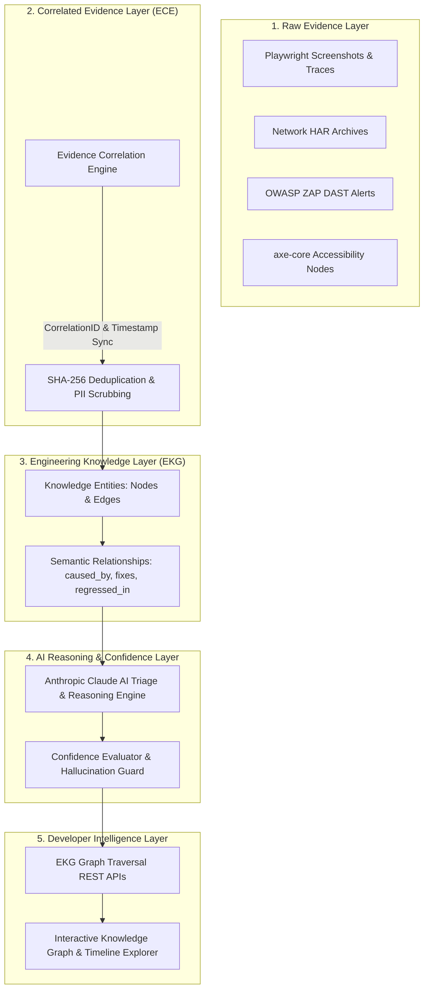

# FLAWNETIC ENGINEERING KNOWLEDGE GRAPH (EKG)
**Document ID:** `ARCH-EKG-PHASE3.2-2026-001`  
**Version:** 1.0  
**Status:** TECHNICAL ARCHITECTURE SPECIFICATION  
**Classification:** CORE INTELLIGENCE PLATFORM ARCHITECTURE  
**Phase Target:** Phase 3.2 Engineering Knowledge Platform  
**File Location:** `docs/ENGINEERING_KNOWLEDGE_GRAPH.md`  
**Approval Authority:** Architecture Review Board (Distinguished Software Architect, Principal Knowledge Graph Engineer, AI Systems Architect)

---

## 1. EXECUTIVE SUMMARY

The **Flawnetic Engineering Knowledge Graph (EKG)** is the intelligence backbone of the Flawnetic Quality Platform. It elevates isolated QA data (screenshots, HTML DOMs, network HAR logs) into connected, actionable **Engineering Knowledge**.

Instead of storing bugs in static relational tables, the EKG connects applications, repositories, releases, commits, pull requests, DOM components, network endpoints, security alerts, and AI remediations into a **directional, time-aware semantic knowledge graph**.

The EKG answers critical engineering questions autonomously:
- *"Why did this bug occur, and which commit introduced it?"*
- *"Which API endpoints and UI components are impacted by this regression?"*
- *"Has this exact security vulnerability appeared in previous releases?"*
- *"What is the exact confidence score of the proposed root-cause fix?"*

---

## 2. LAYERED PLATFORM ARCHITECTURE



---

## 3. ENTITY CATALOG & KNOWLEDGE TAXONOMY

The EKG models software systems using 12 core entity categories:

```text
┌─────────────────────────┬────────────────────────────────────────────────────────────────────────┐
│ Entity Category         │ Domain Entities Included                                               │
├─────────────────────────┼────────────────────────────────────────────────────────────────────────┤
│ 1. Core Platform        │ Organization, Project, Application, Environment, FeatureFlag            │
│ 2. Version Control      │ Repository, Branch, Commit, PullRequest, Contributor, ReleaseTag       │
│ 3. Execution Pipeline   │ ScanRun, ScanSession, BrowserContext, SeedPage, TargetRoute            │
│ 4. System Runtime       │ Container, WorkerProcess, RedisQueue, APIEndpoint, DatabaseTable        │
│ 5. DOM & UI             │ Page, Frame, DOMElement, CSSSelector, AccessibilityTreeNode            │
│ 6. Network & Protocol   │ NetworkRequest, NetworkResponse, HTTPHeader, StorageCookie             │
│ 7. Findings & QA        │ Finding, FunctionalBug, SecurityVulnerability, AccessibilityViolation  │
│ 8. Digital Forensics    │ ScreenshotArtifact, PlaywrightTrace, HARArchive, ConsoleExceptionStack │
│ 9. AI Intelligence      │ AIRootCauseAnalysis, RemediationPatch, ConfidenceScore, EvidenceWeight │
│ 10. Test Governance     │ TestCase, TestSuite, TestExecution, CIJob, PhaseGateResult             │
│ 11. Reporting           │ PDFReport, VectorChart, DashboardWidget, SectionReference              │
│ 12. Knowledge System    │ KnowledgeNode, SemanticEdge, HistoricalRegression, TimelineEvent        │
└─────────────────────────┴────────────────────────────────────────────────────────────────────────┘
```

---

## 4. RELATIONSHIP DIRECTIONAL GRAPH MATRIX

Entities are connected via directional, typed semantic edges with explicit cardinality:

```text
(Commit)   ──[ introduced_by ]──> (Finding)
(Finding)  ──[ caused_by ]────> (DOMElement)
(Finding)  ──[ observed_in ]──> (ScanRun)
(Finding)  ──[ regressed_in ]──> (ReleaseTag)
(Commit)   ──[ fixes ]─────────> (Finding)
(Finding)  ──[ supported_by ]──> (ScreenshotArtifact)
(Finding)  ──[ verified_by ]──> (TestCase)
(APIEndpoint)─[ impacts ]──────> (DOMElement)
```

---

## 5. CONFIDENCE SCORING FORMULA

Every node, edge, and AI conclusion carries an objective **Confidence Score ($\mathcal{C}$)** between `0.00` and `1.00`:

$$\mathcal{C} = \min\left(1.0, w_e E_q + w_f E_f + w_n E_n + w_s R_s - P_c\right)$$

Where:
- $E_q$: Evidence Quality Score (0.0 to 1.0 based on trace/HAR presence). Weight $w_e = 0.35$.
- $E_f$: Evidence Freshness (1.0 for active scan, decaying over time). Weight $w_f = 0.15$.
- $E_n$: Quantity of Correlated Evidence Nodes ($N \ge 3 \rightarrow 1.0$). Weight $w_n = 0.20$.
- $R_s$: Historical Regression Similarity (0.0 to 1.0 via vector embeddings). Weight $w_s = 0.30$.
- $P_c$: Contradiction Penalty (0.25 if contradicting logs exist).

---

## 6. STORAGE ARCHITECTURE & HYBRID STRATEGY (ADR 008)

### Architectural Alternatives Evaluated:
1. Pure Graph DB (Neo4j): High operational overhead and additional infrastructure service.
2. Pure Relational (PostgreSQL): Slow recursive graph traversals (`WITH RECURSIVE`).
3. **Hybrid PostgreSQL 16 + JSONB + `pgvector` (SELECTED)**:
   - Use relational tables for transactional CRUD (Projects, Scans, Users).
   - Use indexed `JSONB` for graph nodes/edges and `pgvector` for semantic code similarity.
   - Leverages existing PostgreSQL 16 stack without adding new database containers.

---

## 7. EKG PLATFORM REST APIS

### `GET /api/v1/ekg/nodes/{node_id}`
Retrieves a specific Knowledge Node along with its incoming/outgoing edges.

### `POST /api/v1/ekg/graph/traverse`
Executes a multi-hop graph traversal starting from a `FindingID` to discover root causes.

### `GET /api/v1/ekg/root-cause/{finding_id}`
Returns AI-synthesized root-cause analysis backed by the top-weighted evidence sub-graph.

---

## 8. ARCHITECTURE DECISION RECORD (ADR 008)

- **Status**: Accepted
- **Context**: Need a unified knowledge model connecting code commits, DOM elements, Playwright evidence, and security findings.
- **Decision**: Build the Engineering Knowledge Graph (EKG) using PostgreSQL 16 + JSONB adjacency lists + `pgvector` embeddings.
- **Rationale**: Eliminates developer guesswork, enables instant regression detection across releases, and maximizes AI triage accuracy with source attribution.
